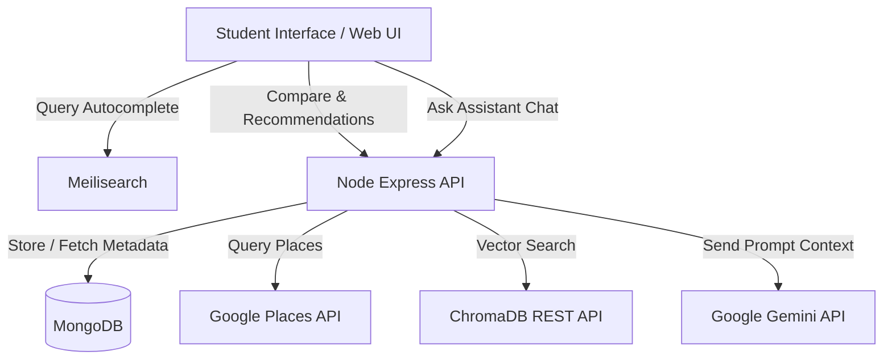

# UniSphere | AI-powered College Comparison & Recommendation Platform

UniSphere is a full-stack, production-ready educational guidance platform built with the MERN stack (MongoDB, Express, React, Node.js) in pure JavaScript. It features a premium, light/dark mode glassmorphic UI, semantic autocomplete search, side-by-side matrices, places detection, RAG-powered chatbot queries, and matching recommendations.

---

## Technical Architecture



### Key Subsystems:
1. **Semantic Autocomplete**: Synchronized indices in Meilisearch provide high-speed suggestions as students type.
2. **Vector DB Integration (RAG)**: Ingests structured college text documents into ChromaDB. During user queries, searches vector databases utilizing `BAAI/bge-large-en-v1.5` embeddings to build accurate context for Gemini.
3. **AI Chatbot**: Pipes streaming HTTP chunked transfers to support ChatGPT-style typing effects.
4. **Google Maps Integration**: Obtains nearby restaurants, cafes, hospitals, shopping malls, and transit hubs for any college location coordinates.
5. **Recommendation Engine**: Scores matching colleges based on NIRF standings, package numbers, tuition constraints, and preferred cities.

---

## Project Structure

```
d:/AI_CHATBOT/
├── client/                 # React Frontend (Vite)
│   ├── public/
│   ├── src/
│   │   ├── components/     # Navbar, Footer, LoginModal, Hero banner
│   │   ├── context/        # AuthContext, ThemeContext
│   │   ├── pages/          # Home, CollegeDetails, Compare, Chat, Admin, Recommendations
│   │   ├── services/       # api.js axios client
│   │   ├── App.jsx         # Routes mounting
│   │   └── index.css       # Tailwind base, dark mode config, glassmorphism CSS
├── server/                 # Express Backend
│   ├── controllers/        # authController, collegeController, chatController, reviewController, embeddingController
│   ├── middleware/         # auth (JWT checks and Admin gates)
│   ├── models/             # Mongoose schemas (User, College, Review)
│   ├── routes/             # API routing
│   ├── services/           # geminiService, chromaService, meiliService, placesService
│   ├── scripts/            # seed.js database initialiser
│   └── server.js           # Server startup script
├── .env                    # Environment credentials variables (root)
└── README.md
```

---

## Environment Configuration

Create a `.env` file at the root:

```env
# MongoDB Connection
MONGODB_URI=mongodb://localhost:27017/college-platform

# JWT Authentication
JWT_SECRET=super_secret_jwt_key_change_me_in_production

# Google Gemini API Key
GEMINI_API_KEY=your-gemini-api-key-here

# Google Maps Places API Key
GOOGLE_MAPS_API_KEY=your-google-places-key-here

# Meilisearch Server Configuration
MEILISEARCH_HOST=http://localhost:7700
MEILISEARCH_API_KEY=your-meilisearch-key-here

# Vector Database (ChromaDB) Configuration
CHROMADB_HOST=http://localhost:8000
CHROMADB_PORT=8000

# Embeddings Model Configuration
EMBEDDING_MODEL=BAAI/bge-large-en-v1.5

# Server Port
PORT=5000
```

*Note: Built-in automated fallbacks mock data calculations are in place if Meilisearch, ChromaDB, Gemini, or Google Places keys are not configured or offline, enabling immediate out-of-the-box local testing.*

---

## Setup & Running

### 1. Install Dependencies

**Backend:**
```bash
cd server
npm install
```

**Frontend:**
```bash
cd ../client
npm install
```

### 2. Seed the Database
Make sure MongoDB is running locally. Then execute the database seeder to register sample records, default admin profiles, and default student accounts:
```bash
cd ../server
npm run seed
```

**Default Demo Credentials:**
- **Student Account**: `rahul@student.com` / `studentpassword123`
- **Admin Account**: `admin@college.com` / `adminpassword123`

### 3. Run the Backend Server
```bash
npm run dev
```
The server will boot on `http://localhost:5000`.

### 4. Run the React Client
```bash
cd ../client
npm run dev
```
Open `http://localhost:5173` in your browser to explore the platform.
