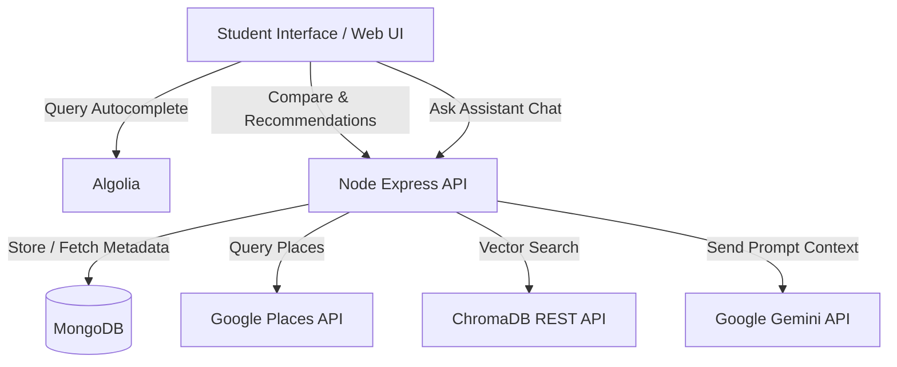

# UniSphere | AI-powered College Comparison & Recommendation Platform

UniSphere is a full-stack, production-ready educational guidance platform built with the MERN stack (MongoDB, Express, React, Node.js) in pure JavaScript. It features a warm, light-only editorial UI, semantic autocomplete search, side-by-side matrices, places detection, RAG-powered chatbot queries, and matching recommendations.

---

## Technical Architecture


```mermaid
graph TD
    User[Student Interface / Web UI] -->|Query Autocomplete| MS[Algolia]
    User -->|Compare & Recommendations| BE[Node Express API]
    User -->|Ask Assistant Chat| BE
    BE -->|Store / Fetch Metadata| DB[(MongoDB)]
    BE -->|Query Places| GM[Google Places API]
    BE -->|Vector Search| CV[ChromaDB REST API]
    BE -->|Send Prompt Context| Gemini[Google Gemini API]
```

### Key Subsystems:
1. **Semantic Autocomplete**: Synchronized indices in Algolia provide high-speed suggestions as students type (with an automatic MongoDB regex fallback).
2. **Vector DB Integration (RAG)**: Ingests structured college text documents into ChromaDB. During user queries, it searches the vector database using `BAAI/bge-large-en-v1.5` embeddings, generated in-process by Transformers.js (`@huggingface/transformers` on the ONNX runtime) to build accurate context for Gemini.
3. **AI Chatbot**: Pipes streaming HTTP chunked transfers to support ChatGPT-style typing effects.
4. **Google Maps Integration**: Obtains nearby restaurants, cafes, hospitals, shopping malls, and transit hubs for any college location coordinates.
5. **Recommendation Engine**: Scores matching colleges based on NIRF standings, package numbers, tuition constraints, and preferred cities.

---

## Project Structure

```
UniSphere/
├── client/                 # React Frontend (Vite)
│   ├── .env                # Vite env — VITE_* only (git-ignored)
│   ├── public/
│   ├── src/
│   │   ├── components/     # Navbar, Footer, LoginModal, Hero, Dropdown
│   │   ├── context/        # AuthContext
│   │   ├── lib/            # motion.jsx — shared animation variants
│   │   ├── pages/          # Home, CollegeDetails, Compare, Chat, Admin, Recommendations
│   │   ├── services/       # api.js axios client
│   │   ├── App.jsx         # Routes mounting
│   │   └── index.css       # Design tokens, Tailwind base, scrollbar + marquee
├── server/                 # Express Backend
│   ├── controllers/        # authController, collegeController, chatController, reviewController, embeddingController
│   ├── middleware/         # auth (JWT checks and Admin gates)
│   ├── models/             # Mongoose schemas (User, College, Review)
│   ├── routes/             # API routing
│   ├── services/           # geminiService, chromaService, searchService, placesService
│   ├── config/             # env.js — the single dotenv loader
│   ├── scripts/            # seed.js database initialiser, checkDb.js
│   ├── .env                # Backend credentials (git-ignored)
│   └── server.js           # Server startup script
└── README.md
```

---

## Environment Configuration

Create `server/.env` and fill in the values you have. The `.env` files are the only environment files in this repository, and they are git-ignored so they never reach a commit.

The backend loads `server/.env` first and falls back to a repository-root `.env`, so either location works. Only `MONGODB_URI` and `JWT_SECRET` are strictly required — every third-party integration below degrades to a local mock/fallback while its key is empty.

```env
# Server
PORT=5000
NODE_ENV=development
CLIENT_URL=http://localhost:5173

# MongoDB Connection
MONGODB_URI=mongodb://localhost:27017/college-platform

# JWT Authentication
JWT_SECRET=super_secret_jwt_key_change_me_in_production

# Google Gemini API Key (AI summaries + RAG chat)
GEMINI_API_KEY=your-gemini-api-key-here

# Google Maps Places API Key (nearby facilities)
GOOGLE_MAPS_API_KEY=your-google-places-key-here

# Algolia search configuration (semantic autocomplete + index sync)
ALGOLIA_APP_ID=your-algolia-app-id

# Write key — creates/updates/deletes index records. Server-side only.
ALGOLIA_WRITE_API_KEY=your-algolia-write-key

# Search key — query-only, least privilege.
ALGOLIA_SEARCH_API_KEY=your-algolia-search-key

ALGOLIA_INDEX_NAME=colleges

# Vector Database (ChromaDB) Configuration
CHROMADB_HOST=http://localhost:8000

# Optional alternative chat provider
LLAMA_API_KEY=your-llama-api-key
```

*Note: Built-in automated fallbacks (mock data + MongoDB search) are in place if Algolia, ChromaDB, Gemini, or Google Places keys are not configured or offline, enabling immediate out-of-the-box local testing.*

---

## Setup & Running

### Prerequisites

- **Node.js 20.19 or newer** (built and tested here on Node 24).
- **MongoDB** running locally, or a MongoDB Atlas connection string in `MONGODB_URI`.

No C++ toolchain or Visual Studio build tools are required: the only native dependencies (`sharp`, `onnxruntime-node`) ship prebuilt binaries for Windows, macOS, and Linux. The first embedding request downloads the quantized `Xenova/bge-large-en-v1.5` ONNX model (roughly 330 MB) into the local Transformers.js cache; later runs reuse it. Until the model is cached, `chromaService` transparently falls back to deterministic local vectors.

### 1. Install Dependencies

**Backend:**
```bash
cd server
npm install
```

**Frontend:**
```bash
cd ../client
npm install
```

Or install all three workspaces at once from the repository root:
```bash
npm run install-all
```

### 2. Seed the Database
Make sure MongoDB is running locally. Then execute the database seeder to register sample records, default admin profiles, and default student accounts:
```bash
cd ../server
npm run seed
```

**Default Demo Credentials:**
- **Student Account**: `rahul@student.com` / `studentpassword123`
- **Admin Account**: `admin@college.com` / `adminpassword123`

### 3. Run the Backend Server
```bash
npm run dev
```
The server will boot on `http://localhost:5000`.

### 4. Run the React Client
```bash
cd ../client
npm run dev
```
Open `http://localhost:5173` in your browser to explore the platform.
