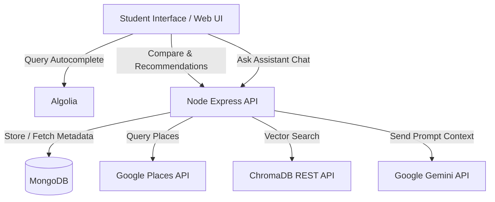

# UniSphere | AI-powered College Comparison & Recommendation Platform

UniSphere is a full-stack, production-ready educational guidance platform built with the MERN stack (MongoDB, Express, React, Node.js) in pure JavaScript. It features a warm, light-only editorial UI, semantic autocomplete search, side-by-side matrices, places detection, RAG-powered chatbot queries, and matching recommendations.

---

## Technical Architecture


```mermaid
graph TD
    User[Student Interface / Web UI] -->|Query Autocomplete| MS[Algolia]
    User -->|Compare & Recommendations| BE[Node Express API]
    User -->|Ask Assistant Chat| BE
    BE -->|Store / Fetch Metadata| DB[(MongoDB)]
    BE -->|Query Places| GM[Google Places API]
    BE -->|Vector Search| CV[ChromaDB REST API]
    BE -->|Send Prompt Context| Gemini[Google Gemini API]
```

### Key Subsystems:
1. **Semantic Autocomplete**: Synchronized indices in Algolia provide high-speed suggestions as students type (with an automatic MongoDB regex fallback).
2. **Vector DB Integration (RAG)**: Ingests structured college text documents into ChromaDB. During user queries, it searches the vector database using `BAAI/bge-large-en-v1.5` embeddings, generated in-process by Transformers.js (`@huggingface/transformers` on the ONNX runtime) to build accurate context for Gemini.
3. **AI Chatbot**: Pipes streaming HTTP chunked transfers to support ChatGPT-style typing effects.
4. **Google Maps Integration**: Obtains nearby restaurants, cafes, hospitals, shopping malls, and transit hubs for any college location coordinates.
5. **Recommendation Engine**: Scores matching colleges based on NIRF standings, package numbers, tuition constraints, and preferred cities.
6. **Open-data directory**: The college directory is built from public datasets (Hugging Face + UGC) instead of a bundled demo file, and can be re-synced from those sources at any time. See [College Data & Open Datasets](#college-data--open-datasets).

---

## Project Structure

```
UniSphere/
├── client/                 # React Frontend (Vite)
│   ├── .env                # Vite env — VITE_* only (git-ignored)
│   ├── public/
│   ├── src/
│   │   ├── components/     # Navbar, Footer, LoginModal, Hero, Dropdown
│   │   ├── context/        # AuthContext (Google sign-in via Firebase)
│   │   ├── lib/            # motion.jsx, format.js — shared variants + display helpers
│   │   ├── pages/          # Home, CollegeDetails, Compare, Chat, Admin, Recommendations
│   │   ├── services/       # api.js axios client, firebase.js auth helpers
│   │   ├── App.jsx         # Routes mounting
│   │   └── index.css       # Design tokens, Tailwind base, scrollbar + marquee
├── server/                 # Express Backend
│   ├── controllers/        # authController, collegeController, chatController, reviewController, embeddingController
│   ├── data/               # colleges.open-data.json — cached dataset snapshot (generated)
│   ├── middleware/         # auth (JWT checks and Admin gates)
│   ├── models/             # Mongoose schemas (User, College, Review)
│   ├── routes/             # API routing
│   ├── services/           # geminiService, chromaService, searchService, placesService, datasetService
│   ├── config/             # env.js — the single dotenv loader
│   ├── scripts/            # seed.js, syncDatasets.js, checkDb.js
│   ├── .env                # Backend credentials (git-ignored)
│   └── server.js           # Server startup script
└── README.md
```

---

## Environment Configuration

Create `server/.env` and fill in the values you have. The `.env` files are the only environment files in this repository, and they are git-ignored so they never reach a commit.

The backend loads `server/.env` first and falls back to a repository-root `.env`, so either location works. Only `MONGODB_URI` and `JWT_SECRET` are strictly required — every third-party integration below degrades to a local mock/fallback while its key is empty.

```env
# Server
PORT=5000
NODE_ENV=development
CLIENT_URL=http://localhost:5173

# MongoDB Connection
MONGODB_URI=mongodb://localhost:27017/college-platform

# JWT Authentication
JWT_SECRET=super_secret_jwt_key_change_me_in_production

# Google Gemini API Key (AI summaries + RAG chat)
GEMINI_API_KEY=your-gemini-api-key-here

# Google Maps Places API Key (nearby facilities)
GOOGLE_MAPS_API_KEY=your-google-places-key-here

# Algolia search configuration (semantic autocomplete + index sync)
ALGOLIA_APP_ID=your-algolia-app-id

# Write key — creates/updates/deletes index records. Server-side only.
ALGOLIA_WRITE_API_KEY=your-algolia-write-key

# Search key — query-only, least privilege.
ALGOLIA_SEARCH_API_KEY=your-algolia-search-key

ALGOLIA_INDEX_NAME=colleges

# Vector Database (ChromaDB) Configuration
CHROMADB_HOST=http://localhost:8000

# Firebase Authentication — verifies Firebase ID tokens sent by the client.
# Must match the client's VITE_FIREBASE_PROJECT_ID.
FIREBASE_PROJECT_ID=your-firebase-project-id

# Comma-separated Google emails that should receive the admin role on sign-in.
# Sign-in is Google-only, so this is how an administrator account is created.
ADMIN_EMAILS=you@example.com

# Optional alternative chat provider
LLAMA_API_KEY=your-llama-api-key
```

The frontend reads its own Firebase Web SDK keys from `client/.env` (these are public by design and safe to ship to the browser):

```env
VITE_FIREBASE_API_KEY=your-web-api-key
VITE_FIREBASE_AUTH_DOMAIN=your-project.firebaseapp.com
VITE_FIREBASE_PROJECT_ID=your-firebase-project-id
VITE_FIREBASE_STORAGE_BUCKET=your-project.appspot.com
VITE_FIREBASE_MESSAGING_SENDER_ID=your-sender-id
VITE_FIREBASE_APP_ID=your-app-id
```

*Note: Built-in automated fallbacks (mock data + MongoDB search) are in place if Algolia, ChromaDB, Gemini, Google Places, or Firebase keys are not configured or offline, enabling immediate out-of-the-box local testing.*

### Enabling Google Sign-in (Firebase)

Google is the only sign-in method in the UI. Until the six `VITE_FIREBASE_*` values are present, the sign-in modal shows a setup checklist instead of a button, so nothing fails silently.

1. Create a project at [console.firebase.google.com](https://console.firebase.google.com).
2. **Authentication → Sign-in method**: enable **Google**.
3. **Project settings → Your apps**: register a Web app and copy its config into `client/.env`.
4. Put the same project ID in `server/.env` as `FIREBASE_PROJECT_ID`.
5. Add your dev origin (e.g. `localhost`) under **Authentication → Settings → Authorized domains**.
6. Add your own Google address to `ADMIN_EMAILS` in `server/.env` to get the admin dashboard.

Successful Firebase sign-ins are mirrored into MongoDB (the `User` document gains a `firebaseUid`) and exchanged for the app's JWT via `POST /api/auth/firebase`, so protected/admin routes keep working. Firebase ID tokens are verified server-side against Google's rotating public certificates — no service-account key required.

The seeded email/password accounts still exist in the database and continue to work through `POST /api/auth/login` (handy for API testing with `curl`), but they are no longer reachable from the UI.

---

## College Data & Open Datasets

The directory is seeded from public datasets rather than a bundled demo JSON file. `server/services/datasetService.js` downloads them, normalizes them into the `College` schema, and caches the result at `server/data/colleges.open-data.json`.

| Source | Rows | What it contributes |
| --- | --- | --- |
| [DropTheHQ/global-universities](https://huggingface.co/datasets/DropTheHQ/global-universities) (Hugging Face) | 27,099 raw → ~1,350 India | Institution names, city, founding year, student counts, websites |
| [UGC Indian University Dataset](https://github.com/Bluff-0/UGC_Indian-University-Dataset) (GitHub) | 976 | UGC-recognised universities with postal addresses, websites, contact details |

Neither source needs an API key or an account. During ingestion the pipeline:

- parses the state/UT and city out of free-text postal addresses,
- de-duplicates by normalised name across both sources (richer row wins),
- records provenance on every document (`sourceKey`, `source`, `syncedAt`).

### Refreshing the data

```bash
cd server
npm run data:sync            # download + rewrite the cached snapshot
npm run data:sync -- --save  # also upsert into MongoDB (never deletes)
npm run seed                 # full rebuild: wipe + curated profiles + open data
```

Admins can also press **Refresh open data** on the dashboard, which calls `POST /api/colleges/refresh` and upserts by `sourceKey`. `GET /api/colleges/dataset` reports which sources fed the directory and when it last synced; the home page header shows that freshness. If the download fails during `npm run seed`, the cached snapshot is used instead, so seeding still works offline.

### What open data does *not* contain

These datasets describe institution identity and location, not commercial outcomes. Fees, placement packages, placement rates and NIRF ranks are therefore absent for imported rows — the UI shows “Not reported” / “Unranked” instead of inventing numbers. The five curated profiles (RVCE, BMSCE, Christ, IIIT Bangalore, IIT Bombay) keep their hand-entered figures so the comparison table and placement charts stay meaningful.

Adding a source means appending an entry to `SOURCES` in `datasetService.js`. Kaggle-hosted datasets can be added the same way, but the Kaggle download API requires a `KAGGLE_USERNAME`/`KAGGLE_KEY` credential pair.

---

## Setup & Running

### Prerequisites

- **Node.js 20.19 or newer** (built and tested here on Node 24).
- **MongoDB** running locally, or a MongoDB Atlas connection string in `MONGODB_URI`.

No C++ toolchain or Visual Studio build tools are required: the only native dependencies (`sharp`, `onnxruntime-node`) ship prebuilt binaries for Windows, macOS, and Linux. The first embedding request downloads the quantized `Xenova/bge-large-en-v1.5` ONNX model (roughly 330 MB) into the local Transformers.js cache; later runs reuse it. That load starts in the background at boot (only when ChromaDB is reachable) and is time-boxed, so a cold cache never hangs a chat request — until the model is ready, `chromaService` falls back to MongoDB keyword search.

### 1. Install Dependencies

**Backend:**
```bash
cd server
npm install
```

**Frontend:**
```bash
cd ../client
npm install
```

Or install all three workspaces at once from the repository root:
```bash
npm run install-all
```

### 2. Seed the Database
Make sure MongoDB is running (local or Atlas). Then run the seeder — it downloads the open datasets, writes the cached snapshot, inserts the curated profiles, and creates the demo accounts:
```bash
cd ../server
npm run seed
```

The first run needs internet access to reach the two public datasets; if they are unreachable, the previously cached snapshot is used.

**Demo accounts (API testing only — the UI signs in with Google):**
- **Student Account**: `rahul@student.com` / `studentpassword123`
- **Admin Account**: `admin@college.com` / `adminpassword123`

`npm run seed` clears the `users` and `colleges` collections before inserting, so it is a development tool, not something to run against a database with real accounts.

### 3. Run the Backend Server
```bash
npm run dev
```
The server will boot on `http://localhost:5000`.

### 4. Run the React Client
```bash
cd ../client
npm run dev
```
Open `http://localhost:5173` in your browser to explore the platform.
